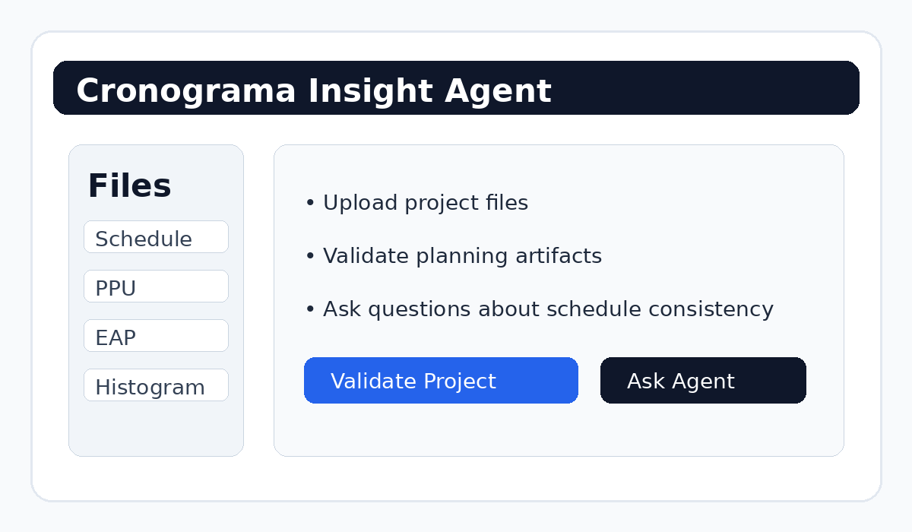

# Cronograma Insight Agent

[](https://www.python.org/)
[](https://fastapi.tiangolo.com/)
[](https://streamlit.io/)
[](https://www.docker.com/)
[](LICENSE)

AI-powered schedule validation tool for engineering and construction projects.

---

## Overview

**Cronograma Insight Agent** is a portfolio-ready full-stack project that analyzes project planning artifacts and highlights inconsistencies across schedule, cost, WBS, and workforce allocation files.

It was designed as a practical demonstration of:

- document-driven workflows
- rules-based validation
- AI-ready architecture
- simple but polished product thinking
- deployable Python full-stack engineering

The application accepts project files and helps answer questions such as:

- Are there activities without budget coverage?
- Does the WBS appear in the schedule?
- Are there activities without workforce allocation?
- Are the planning artifacts consistent with each other?

---

## Features

### Current
- Upload structured project files
- Validate consistency between:
  - schedule
  - unit price plan (PPU)
  - work breakdown structure (EAP)
  - workforce histogram
- View validation summary and issue list
- Ask natural-language questions over the latest validation result
- Run locally or with Docker Compose
- CI pipeline with lint/test bootstrap

### Planned
- LLM orchestration
- Gemini / OpenAI integration
- pgvector support for semantic retrieval
- PDF report export
- authentication and multi-user history
- cloud deployment on GCP or Azure

---

## Architecture

```text
┌─────────────────────┐
│   Streamlit UI      │
│  Upload + Q&A       │
└─────────┬───────────┘
          │ HTTP
          ▼
┌─────────────────────┐
│   FastAPI Backend   │
│ upload / validate   │
│ ask / state         │
└──────┬───────┬──────┘
       │       │
       │       └──────────────┐
       ▼                      ▼
┌───────────────┐      ┌──────────────────┐
│ Parsing Layer │      │ Validation Layer │
│ CSV/XLSX/PDF  │      │ Rules Engine     │
└───────────────┘      └──────────────────┘

Future evolution:
- LLM orchestration
- vector database
- cloud persistence
```

---


## Product Preview



This animation illustrates the expected product flow: document upload, cross-validation, and question answering over the latest project analysis.

## Tech Stack

- **Backend:** FastAPI, Uvicorn
- **Frontend:** Streamlit
- **Data processing:** Pandas, OpenPyXL, PyPDF
- **Tooling:** Docker, Docker Compose, Makefile, pytest
- **CI/CD:** GitHub Actions

---

## Project Structure

```text
cronograma-insight-agent/
├── .github/
│   └── workflows/
│       └── ci.yml
├── backend/
│   ├── app.py
│   ├── config.py
│   └── services/
│       ├── parser_excel.py
│       ├── parser_pdf.py
│       ├── qa_service.py
│       └── validator.py
├── frontend/
│   └── app.py
├── data/
│   └── exemplos/
├── tests/
│   └── test_validator.py
├── .env.example
├── .gitignore
├── Dockerfile.backend
├── Dockerfile.frontend
├── docker-compose.yml
├── Makefile
├── LICENSE
├── requirements.txt
└── README.md
```

---

## Getting Started

### Local run

```bash
python -m venv .venv
source .venv/bin/activate
pip install -r requirements.txt
uvicorn backend.app:app --reload --port 8000
```

In another terminal:

```bash
source .venv/bin/activate
streamlit run frontend/app.py --server.port 8501
```

### Docker run

```bash
docker compose up --build
```

or

```bash
make up
```

### Access

- Frontend: `http://localhost:8501`
- Backend docs: `http://localhost:8000/docs`

---

## Example Files

You can test the app with the sample files inside:

```text
data/exemplos/
```

Recommended order:

1. `cronograma_exemplo.csv`
2. `ppu_exemplo.csv`
3. `eap_exemplo.csv`
4. `histograma_exemplo.csv`

Then click **Validate Project**.

---

## Example Questions

- Are there activities without budget coverage?
- Is the WBS aligned with the schedule?
- Are there activities without assigned resources?
- What are the main inconsistencies in the current project?

---

## CI Pipeline

The repository includes a GitHub Actions workflow that:

- installs dependencies
- checks Python compilation
- runs unit tests

File:

```text
.github/workflows/ci.yml
```

---

## GitHub Setup

After extracting the ZIP:

```bash
git init
git add .
git commit -m "feat: initial professional version of cronograma insight agent"
git branch -M main
git remote add origin https://github.com/YOUR_USERNAME/cronograma-insight-agent.git
git push -u origin main
```

---

## Roadmap Ideas

- integrate Gemini for grounded answers
- persist uploads in PostgreSQL + object storage
- add report generation in PDF
- support schedule version comparison
- deploy on Cloud Run or Azure Container Apps

---

## License

MIT License.

---

## Author

Frederico Balieiro
